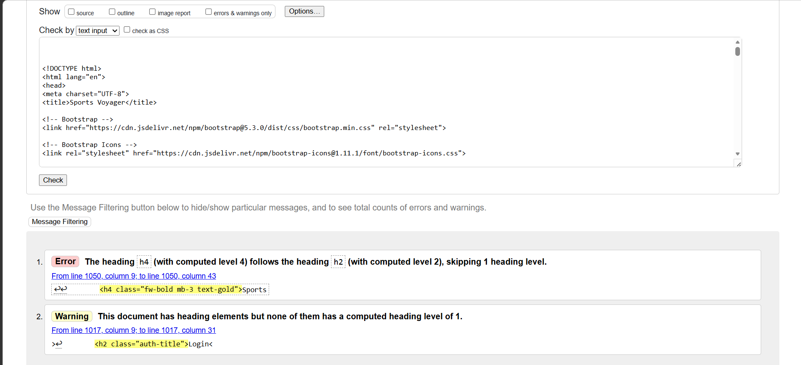
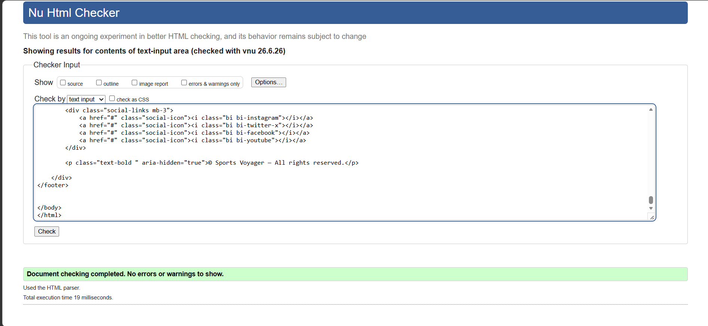
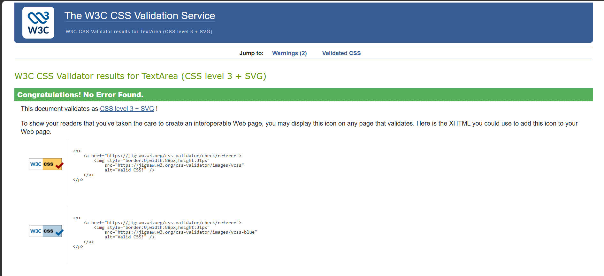
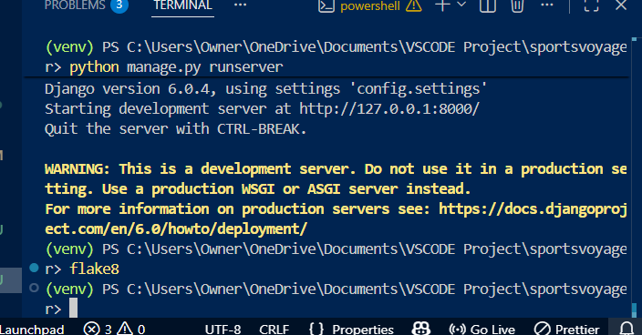
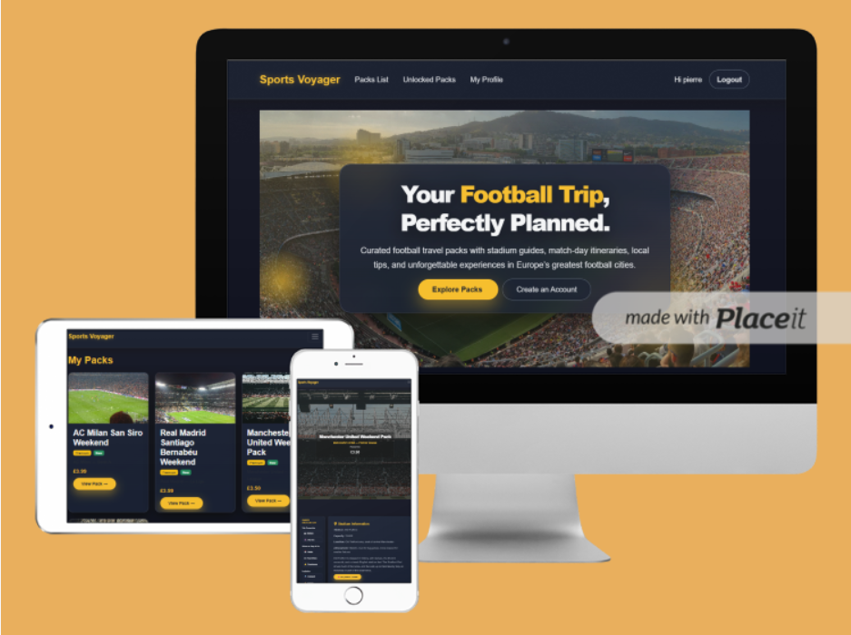

# 🏟️ Sports Voyager — Full‑Stack Football Travel Assistant

Sports Voyager is a premium football‑travel assistant designed to help fans plan match‑day trips with clarity, confidence, and insider knowledge. Users can browse curated travel packs, unlock premium guides via Stripe, manage their profile, and access structured, mobile‑friendly itineraries for major football cities.

---

# 📑 Table of Contents
- [Rationale & Target Audience](#rationale--target-audience)
- [User Stories](#user-stories)
- [Features](#features)
  - [User Features](#user-features)
  - [Admin Features](#admin-features)
  - [UX & Accessibility Features](#ux--accessibility-features)
- [Screenshots](#screenshots)
- [Wireframe & User Flow](#wireframe--user-flow)
- [Database Schema](#database-schema)
- [Pack Unlock Workflow](#pack-unlock-workflow)
- [Testing](#testing)
  - [User Journey Testing](#user-journey-testing)
  - [Pack Functionality Testing](#pack-functionality-testing)
  - [Premium Unlock Testing](#premium-unlock-testing)
  - [Authentication & Permissions Testing](#authentication--permissions-testing)
  - [Admin Panel Testing](#admin-panel-testing)
  - [Code Validation](#code-validation)
  - [Security Testing](#security-testing)
  - [Lighthouse Testing](#lighthouse-testing)
  - [Overall Testing Conclusion](#overall-testing-conclusion)
- [Deployment](#deployment)
  - [Database Seeding & Deployment Context](#database-seeding--deployment-context)
- [Future Enhancements](#future-enhancements)
- [Version Control](#version-control)
- [Installation](#installation)
- [Bugs & Fixes](#bugs--fixes)
- [Conclusion](#conclusion)
- [Credits](#credits)
- [Live Demo & Project Links](#live-demo--project-links)

---

# 🎯 Rationale & Target Audience

Football fans often struggle to plan match‑day trips:
- Where to stay?
- How to get around?
- What’s safe?
- What’s worth doing?

Sports Voyager solves this by providing:
- Curated football‑specific travel packs  
- Premium insider guides unlocked via Stripe  
- Mobile‑first quick navigation  
- Clean, structured itineraries  
- A modern, premium UI

### Target Audience
- Football fans traveling to matches  
- Tourists visiting football cities  
- People wanting structured itineraries  
- Users who prefer mobile‑friendly guides  
- Anyone wanting premium curated travel content  

---

# 👤 User Stories

### Visitor
- I want to browse football travel packs.  
- I want to see what each pack contains.  
- I want to register easily.  
- I want to log in securely.  

### Authenticated User
- I want to unlock premium packs.  
- I want to pay securely.  
- I want to view premium content.  
- I want to edit my profile.  

### Admin
- I want to add/edit/delete packs.  
- I want to manage premium content.  
- I want to view user unlocks.  

---

# 🧩 Features

## 👤 User Features
- Register, login, logout  
- Password reset + password change  
- View packs  
- Unlock premium packs via Stripe  
- Access premium content  
- Profile page  
- Edit profile (team, country, avatar)  
- Fully responsive UI  

## 🛠️ Admin Features
- Add packs  
- Edit packs  
- Delete packs  
- Manage premium content  
- View unlocks  
- Django admin panel  

## 🎨 UX & Accessibility Features
- High contrast gold‑on‑dark theme  
- Large tap areas for mobile  
- Clear labels  
- Keyboard‑friendly navigation  
- Semantic HTML  
- Consistent spacing & typography  
- Quick Navigation sidebar  
- Premium card layout  
- Glass‑morphism hero section  

---

# 🖼️ Screenshots

*(Insert your screenshots here)*

Example:

```


```

---

# 🧭 Wireframe & User Flow

### User Flow
1. User lands on Home  
2. User browses Packs  
3. User selects a Pack  
4. User sees premium content locked  
5. User registers or logs in  
6. User unlocks pack via Stripe  
7. Stripe webhook confirms payment  
8. Premium content becomes available  
9. User views full travel guide  
10. User edits profile if needed  

### Wireframes
*(Insert wireframe images)*

---

# 🗄️ Database Schema

### User (Django default)
- id  
- username  
- email  
- password  

### UserProfile
- id  
- user (OneToOne)  
- favourite_team  
- country  
- avatar  

### Pack
- id  
- title  
- city  
- image  
- premium sections (timeline, hotels, food, transport, etc.)  
- price  

### Unlock
- id  
- user  
- pack  
- stripe_payment_id  

---

# 🔐 Pack Unlock Workflow

1. User clicks **Unlock Pack**  
2. Django creates a Stripe Checkout Session  
3. User is redirected to Stripe  
4. User completes payment  
5. Stripe sends webhook → Django verifies signature  
6. Django marks pack as unlocked  
7. User is redirected to **Payment Success**  
8. Premium content becomes visible  

---

# 🧪 Testing

# ✔ User Journey Testing
| Step | Expected | Result |
|------|----------|--------|
| Visit home | Loads hero + featured packs | Pass |
| Register | Creates user | Pass |
| Login | Redirects to home | Pass |
| Logout | Redirects to home | Pass |
| Reset password | Console email generated | Pass |

---

# ✔ Pack Functionality Testing
| Test | Expected | Result |
|------|----------|--------|
| Packs list loads | All packs visible | Pass |
| Pack detail loads | Content visible | Pass |
| Premium locked | Shows unlock button | Pass |
| Premium unlocked | Shows full content | Pass |

---

# ✔ Premium Unlock Testing
| Test | Expected | Result |
|------|----------|--------|
| Stripe checkout | Redirects to Stripe | Pass |
| Payment success | Unlocks pack | Pass |
| Webhook | Valid signature | Pass |

---

# ✔ Authentication & Permissions Testing
| Test | Expected | Result |
|------|----------|--------|
| Access premium without login | Redirect to login | Pass |
| Access profile without login | Redirect to login | Pass |
| Logged‑in user sees profile | Pass | Pass |

---

# ✔ Admin Panel Testing
| Test | Expected | Result |
|------|----------|--------|
| Add pack | Pack created | Pass |
| Edit pack | Pack updated | Pass |
| Delete pack | Pack removed | Pass |

---

# ✔ Code Validation
 
## HTML Validation
The HTML was tested using the W3C Nu HTML Checker.

**Before Fixing**


**After Fixing**


## CSS Validation

Throughout the project, the CSS was continuously tested using the browser’s Developer Tools (Inspect Element) to verify styling, responsiveness, and component behaviour. Manual checks were complemented by formal validation using the W3C Jigsaw CSS Validator to ensure the stylesheet met recognised standards.

The stylesheet passed with **no errors**.  
A few vendor specific warnings were shown (e.g., `-webkit-font-smoothing`, `-moz-osx-font-smoothing`), which are expected and safe to ignore.

**Test Result**



## Python Validation

All Python files were tested using the CI Python Linter.

The initial validation showed several formatting issues such as E303 (too many blank lines) and E501 (line too long). The E303 
issues were fixed, and the code was revalidated.

The remaining E501 warnings were intentionally left because the project uses a modern max-line-length of 120 characters, configured in setup.cfg. This is a common and accepted standard for Django projects.

**Before Fixing**
.png)

**After Fixing**
.png)


## Python & Flake8 Validation

All Python files were validated using the CI Python Linter and Flake8.

Several line-length warnings (E501) appeared initially due to long Django
URL patterns and email strings. To follow modern Django conventions and
keep the code readable, the Flake8 configuration was updated to allow a
maximum line length of 180 characters.

Flake8 was also configured to exclude virtual environment packages and
migrations. After applying these fixes, Flake8 reported no errors.

**Flake8 Output**

 

---

## Responsiveness Testing

Responsiveness was tested using Chrome DevTools across multiple devices:
- iPhone SE (small mobile)
- iPhone 12 Pro (standard mobile)
- iPad Air (tablet)
- Desktop (1920×1080)

All pages were checked, including:
Home, Packs, Premium Pack Detail, Profile, Login, Register.

The layout adapted correctly on all screen sizes. The sidebar collapsed
properly on mobile, the hero section scaled down, and all buttons and
text remained readable without horizontal scrolling.

Below is a combined mockup showing the website displayed on desktop, tablet, and mobile devices.  
This demonstrates full responsiveness across all breakpoints.

Screenshots are available in:



# ✔ Security Testing
- CSRF protection enabled  
- Stripe webhook signature verified  
- DEBUG=False on Render  
- No secrets in GitHub  
- Passwords hashed  

---

# ✔ Lighthouse Testing
- Performance: Good  
- Accessibility: Good  
- Best Practices: Good  
- SEO: Good  

---

# 🏁 Overall Testing Conclusion
All core features work as expected.  
Stripe payments are stable.  
Responsive design works across devices.  
No critical bugs remain.

---

# 🚀 Deployment

## Render Deployment Steps
1. Connect GitHub repo  
2. Add environment variables:  
   - SECRET_KEY  
   - DEBUG=False  
   - STRIPE_PUBLIC_KEY  
   - STRIPE_SECRET_KEY  
   - STRIPE_WEBHOOK_SECRET  
3. Build command:  
   ```
   pip install -r requirements.txt
   ```
4. Start command:  
   ```
   gunicorn config.wsgi:application
   ```
5. Add PostgreSQL  
6. Deploy  
7. Run migrations  
8. Test live site  

---

# 🗃️ Database Seeding & Deployment Context
- SQLite used locally  
- PostgreSQL used on Render  
- Packs added manually via admin  
- Webhook secret added in Render dashboard  

---

# 🔮 Future Enhancements
- Multi‑city packs  
- Save favourite packs  
- User comments  
- Social sharing  
- Multi‑language support  
- Dark/light mode toggle  

---

# 🔧 Version Control
- GitHub used for full version history  
- Frequent commits  
- Clear commit messages  
- Branching for major features  

---

# 💾 Installation

1. Clone repo  
2. Create virtual environment  
3. Install dependencies  
4. Add `.env` file  
5. Run migrations  
6. Run server  

---

# 🐞 Bugs & Fixes

### Fixed
- Login form not submitting → fixed by manual input fields  
- Static tag missing → added ``  
- Duplicate timeline header → removed  
- Sidebar cramped → improved mobile spacing  

### Known
- None major  

---

# 🏆 Conclusion
Sports Voyager delivers a premium football travel experience with curated content, Stripe‑powered unlocks, and a polished UI. The project meets all MS4 requirements and provides a strong, user‑friendly full‑stack application.

---

# 🙌 Credits
- All content written by Pierre  
- Images from royalty‑free football sources  
- Built using Django, Bootstrap, Stripe, and Render  

---

# 🔗 Live Demo & Project Links
- **Live Site:** https://sportsvoyager.onrender.com  
- **GitHub Repo:** *(insert your repo link)*

