# 🏟️ Sports Voyager — Football - Travel Website


Sports Voyager is a full‑stack football‑travel platform designed to help fans plan unforgettable match‑day weekends across Europe. Instead of relying on generic travel websites, Sports Voyager provides **curated, football‑specific travel packs** that give supporters everything they need for a smooth, confident trip, all in one place.

Each travel pack includes:

- Stadium guides and seating insights  
- Match‑day itineraries  
- Local food, nightlife, and neighbourhood recommendations  
- Transport routes from airport → city → stadium  
- Safety notes and emergency contacts  
- Booking links for flights, hotels, and match tickets  
- Premium insider content for registered users  

The platform offers both **free** and **premium** packs. Premium guides are unlocked through **secure Stripe Checkout payments**, with a fully implemented **webhook validation system** ensuring purchased content is delivered instantly and reliably. Users can create an account, manage their profile, comment on packs, and revisit unlocked guides at any time.

Sports Voyager is built with a **mobile‑first, premium UX**, making it ideal for fans who need quick navigation while travelling. The site is fully responsive, accessible, and optimized for performance, delivering a fast, reliable, real‑world trip‑planning experience.

In short, Sports Voyager acts as a **football‑focused travel assistant**, combining curated content, secure payments, and a polished interface to help supporters plan the perfect weekend away, confidently, quickly, and without the usual travel confusion.


---

# 📑 Table of Contents

## 1. Overview
- [Project Summary](#project-summary)
- [Rationale & Target Audience](#rationale--target-audience)
- [Project Goals](#project-goals)

## 2. UX & Design
- [User Stories](#user-stories)
- [Design Principles](#design-principles)
- [Wireframes](#wireframes)
- [UI Screenshots](#ui-screenshots)

## 3. Features
- [Core Features](#core-features)
- [User Features](#user-features)
- [Admin Features](#admin-features)
- [Premium Unlock Workflow](#premium-unlock-workflow)
- [Accessibility Features](#accessibility-features)

## 4. Data & Architecture
- [Technology Stack](#technology-stack)
- [Database Schema](#database-schema)
- [Models Overview](#models-overview)
- [Stripe Integration Flow](#stripe-integration-flow)

## 5. Testing
- [User Journey Testing](#user-journey-testing)
- [Functional Testing](#functional-testing)
- [Premium Unlock Testing](#premium-unlock-testing)
- [Authentication & Permissions Testing](#authentication--permissions-testing)
- [Admin Panel Testing](#admin-panel-testing)
- [Code Validation](#code-validation)
- [Responsiveness Testing](#responsiveness-testing)
- [Security Testing](#security-testing)
- [Lighthouse Testing](#lighthouse-testing)
- [WAVE Accessibility Testing](#wave-accessibility-testing)
- [Overall Testing Conclusion](#overall-testing-conclusion)

## 6. Deployment
- [Render Deployment Steps](#render-deployment-steps)
- [Environment Variables](#environment-variables)
- [Database Setup](#database-setup)
- [Webhook Configuration](#webhook-configuration)

## 7. Version Control
- [Git Workflow](#git-workflow)
- [Branching Strategy](#branching-strategy)

## 8. Future Enhancements
- [Planned Features](#planned-features)
- [Monetization & Business Expansion](#Monetization-expansion)

## 9. Bugs & Fixes
- [Fixed Bugs](#fixed-bugs)
-
- [Known Issues](#known-issues)

## 10. Installation Guide
- [Local Installation](#local-installation)

## 11. Credits
- [Acknowledgements](#acknowledgements)

## 12. Live Demo & Project Links
- [Live Site](#live-site)
- [GitHub Repository](#github-repository)


---

##  Project Summary

Sports Voyager is a football‑travel planning platform that provides curated, city‑specific travel packs for fans visiting Europe’s major football destinations. Each pack includes stadium guides, match‑day itineraries, local recommendations, transport tips, and essential safety notes — all structured for quick, mobile‑friendly consumption.

The platform offers both free and premium content. Premium packs are unlocked through secure Stripe payments, with a fully implemented webhook verification system ensuring reliable delivery of purchased content. Users can create an account, manage their profile, and access unlocked guides at any time.

Sports Voyager is designed with a strong emphasis on accessibility, responsiveness, and performance. The UI follows a premium gold‑on‑dark theme, optimized for mobile users who rely on quick navigation during travel.
The project meets all MS4 full‑stack requirements, combining Django, PostgreSQL, Bootstrap, and Stripe into a polished, production‑ready application deployed on Render.

---

##  Rationale & Target Audience

### Rationale

Planning a football trip can be surprisingly complex. Fans often struggle to find reliable, football specific travel information such as:

- Where to stay near the stadium  
- How to navigate the city on match day  
- What areas are safe or recommended  
- What to do before and after the game  
- How to build a realistic itinerary  

Most travel websites provide generic tourist information, not football‑focused guidance. Sports Voyager fills this gap by offering curated, structured travel packs designed specifically for football travellers. Each pack includes stadium guides, transport tips, match‑day itineraries, local recommendations, and essential safety notes, all organised in a clean, mobile‑first layout.

The platform also introduces a premium unlock system powered by Stripe, allowing users to access deeper insider content while keeping the core browsing experience free.
This creates a realistic, production‑ready full‑stack workflow that demonstrates secure payments, webhook validation, and user‑specific content access.

### Target Audience

Sports Voyager is designed for:

#### ⚽ Football Fans
- Travelling to Europe’s major football cities  
- Wanting stadium‑focused guidance  
- Looking for match‑day itineraries and local tips  

#### ✈️ Travelling Supporters & Tourists
- Visiting football cities for the first time  
- Needing clear, mobile‑friendly navigation  
- Wanting trustworthy recommendations  

#### 👤 Registered Users
- Wanting to unlock premium packs  
- Needing secure payment handling  
- Wanting to revisit unlocked content anytime  

#### 🛠️ Admin Users
- Managing packs and premium content  
- Monitoring user unlocks  
- Maintaining the platform through Django Admin  

Sports Voyager is built for real‑world use: fast, accessible, mobile‑first, and easy to navigate, ideal for fans planning trips on the go.

---

##  Project Goals

Sports Voyager was built with a clear set of goals focused on usability, accessibility, performance, and real‑world functionality. The project aims to deliver a polished, production‑ready football travel assistant that demonstrates strong full‑stack development skills while providing genuine value to users.

###  Core Product Goals
- Provide curated, football‑specific travel packs for major European cities.
- Deliver structured itineraries, stadium guides, transport tips, and local recommendations.
- Offer a clean, premium, mobile‑first interface suitable for travellers on the go.
- Ensure all content is easy to navigate, readable, and accessible.

###  Technical Goals
- Implement secure Stripe payments for unlocking premium content.
- Validate payments using Stripe webhooks and signature verification.
- Build a robust Django backend with clear models and relationships.
- Use PostgreSQL in production for reliability and scalability.
- Deploy a stable, performant application on Render with DEBUG disabled.

###  UX & Accessibility Goals
- Achieve WCAG‑friendly accessibility with no critical errors.
- Provide large tap areas, clear labels, and keyboard‑friendly navigation.
- Maintain high contrast and consistent typography across all pages.
- Reach high Lighthouse scores for Accessibility and Best Practices.

### ✔ Performance & Responsiveness Goals
- Optimize images and layout for fast loading on mobile devices.
- Ensure full responsiveness across phones, tablets, and desktops.
- Achieve high Lighthouse Performance scores on the deployed site.

### ✔ Testing & Quality Goals
- Validate HTML, CSS, Python, and Flake8 compliance.
- Test all user journeys, including registration, login, pack browsing, and premium unlocks.
- Confirm admin functionality for managing packs and content.
- Ensure secure handling of user data and payment flows.

### ✔ Deployment & Maintainability Goals
- Provide clear deployment steps for Render.
- Use environment variables for sensitive keys.
- Maintain clean version control with meaningful commit messages.
- Document all features, workflows, and testing procedures.

Sports Voyager aims to deliver a premium, reliable, and user‑friendly football travel experience while demonstrating strong full‑stack engineering practices suitable for MS4 assessment and real‑world deployment.

---

# 2. UX & Design

##  User Stories

User stories were created to guide the design, functionality, and user experience of Sports Voyager. They ensure the platform meets the needs of real football travellers, supports accessibility, and provides a smooth, intuitive workflow for both regular users and administrators.

### 🧭 Visitor User Stories
- As a visitor, I want to browse football travel packs so I can see what destinations are available.
- As a visitor, I want to view a pack’s overview so I can understand what it contains before registering.
- As a visitor, I want to register easily so I can unlock premium content.
- As a visitor, I want to log in securely so I can access my account and saved packs.

### 🔐 Authenticated User Stories
- As a logged‑in user, I want to unlock premium packs so I can access insider travel content.
- As a logged‑in user, I want to pay securely so I feel confident using the platform.
- As a logged‑in user, I want premium content to unlock automatically after payment so I don’t need to wait or refresh manually.
- As a logged‑in user, I want to view all my unlocked packs so I can revisit them anytime.
- As a logged‑in user, I want to edit my profile (team, country) so my account feels personalised.
- As a logged‑in user, I want the site to be fully responsive so I can use it easily while travelling.

### 🛠️ Admin User Stories
- As an admin, I want to add new packs so I can expand the platform’s content.
- As an admin, I want to edit existing packs so I can keep information up to date.
- As an admin, I want to delete packs so I can remove outdated or incorrect content.
- As an admin, I want to manage premium sections so I can control what users unlock.
- As an admin, I want to view user unlocks so I can monitor Stripe payments and user activity.

### ♿ Accessibility‑Focused User Stories
- As a user with accessibility needs, I want clear headings and labels so I can navigate the site easily.
- As a user with low vision, I want high‑contrast colours so text and buttons remain readable.
- As a keyboard‑only user, I want all interactive elements to be focusable so I can use the site without a mouse.
- As a screen‑reader user, I want meaningful alt text on images so I can understand visual content.
- As a mobile user, I want large tap areas so I can interact comfortably on small screens.

These user stories shaped the entire development process, ensuring Sports Voyager delivers a premium, accessible, and user‑friendly experience for all types of users.


##  Design Principles

Sports Voyager was designed with a clear set of UX and UI principles to ensure the platform feels premium, intuitive, and reliable, especially for users accessing the site on mobile devices while travelling. Every visual and structural decision supports clarity, accessibility, and ease of use.

### ✨ 1. Premium Visual Identity
- Gold‑on‑dark colour palette inspired by luxury sports branding.
- Clean typography with consistent spacing and hierarchy.
- Glass‑morphism elements used sparingly to highlight hero content.
- High‑quality imagery to reinforce the football‑travel theme.

### 📱 2. Mobile‑First Experience
- Layouts designed starting from small screens upward.
- Large tap areas for comfortable interaction on mobile.
- Collapsible navigation and simplified content blocks.
- Optimised hero sections and pack cards for quick scanning.

### 🧭 3. Clear Information Architecture
- Packs presented in a structured, predictable layout.
- Premium content clearly separated from free content.
- Consistent placement of buttons, navigation, and headings.
- Logical flow from browsing → viewing → unlocking → accessing.

### ♿ 4. Accessibility by Default
- High contrast colours for readability in bright outdoor environments.
- Semantic HTML structure for screen‑reader compatibility.
- ARIA labels on icons and interactive elements.
- Keyboard‑friendly navigation and focus states.
- WAVE‑validated with **0 errors** and Lighthouse Accessibility score of **98**.

### ⚡ 5. Performance & Responsiveness
- Optimised images for fast loading on mobile networks.
- Minimal render‑blocking resources.
- Bootstrap grid system for consistent responsiveness.
- Lighthouse Performance score of **99** on the deployed site.

### 🔒 6. Trust & Security
- Clear, predictable payment flow using Stripe Checkout.
- Visual consistency across all pages to reinforce reliability.
- Safe, readable forms with clear validation feedback.

These principles ensure Sports Voyager delivers a polished, accessible, and user‑friendly experience that feels modern, premium, and practical for football travellers.

##  Wireframes

Wireframes were created early in the project to define the core layout, user flow, and structure of Sports Voyager before development began. They helped ensure the interface remained clean, intuitive, and mobile‑first, with clear navigation and predictable content placement. These wireframes represent the original design concepts for the homepage, destination pages, and pack detail pages, forming the foundation for the final UI.

The wireframes focused on the essential user journey:
- Browsing available travel packs  
- Viewing pack details  
- Understanding what is premium vs free  
- Registering or logging in  
- Unlocking premium content  
- Accessing structured itineraries  
- Managing user profile information  

### 📐 Wireframe Objectives
- Establish a clear visual hierarchy for pack browsing and detail pages.  
- Ensure mobile‑first usability with large tap areas and simplified layouts.  
- Separate free content from premium content in a clear, user‑friendly way.  
- Maintain consistent spacing, typography, and navigation across all pages.  
- Provide a predictable flow from landing → browsing → unlocking → accessing.  

### 🖼️ Wireframe Screens
Below are the initial wireframes used during planning. These guided the final UI and ensured the platform remained simple, structured, and easy to navigate.

- HomePage Wireframe
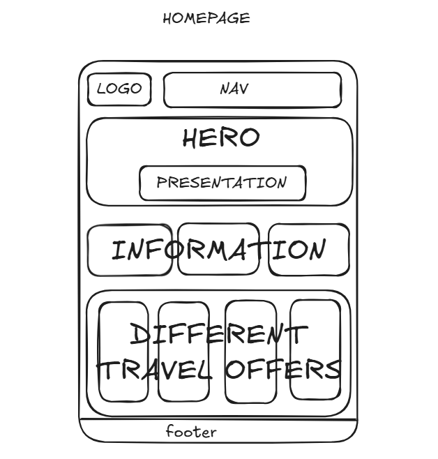

- Pack Wireframe
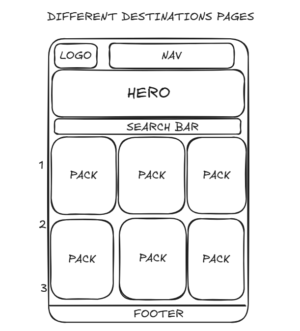

- Pack Detail Wireframe
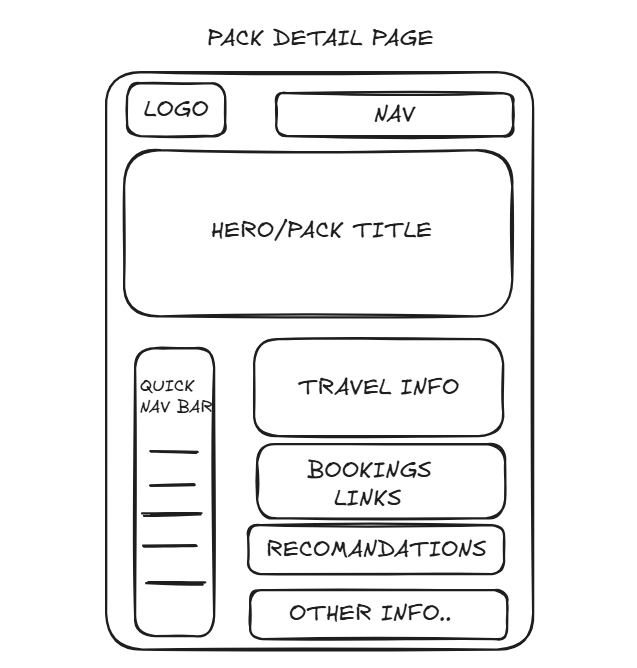


### 🧭 How Wireframes Informed Development
- The hero section and call‑to‑action buttons were refined based on early layout sketches.  
- The pack card layout was designed to match the wireframe’s simple, scroll‑friendly structure.  
- The premium lock indicator and unlock button were placed exactly where planned.  
- The profile page followed the wireframe’s clean, two‑column structure on desktop and stacked layout on mobile.  
- Navigation placement and spacing were kept consistent with the wireframe’s original intent.  

Wireframes ensured the final product remained aligned with the original UX vision and provided a strong foundation for responsive, accessible design.

---

##  UI Screenshots

The following screenshots showcase the final user interface of Sports Voyager. They highlight the clean, mobile‑first design, premium visual identity, and structured layout that evolved from the original wireframes. These images demonstrate how the planned concepts were transformed into a polished, responsive, and accessible user experience. 

### 📱 Homepage
The homepage presents a bold hero section, clear call‑to‑action buttons, and a premium gold‑on‑dark theme that sets the tone for the entire platform.

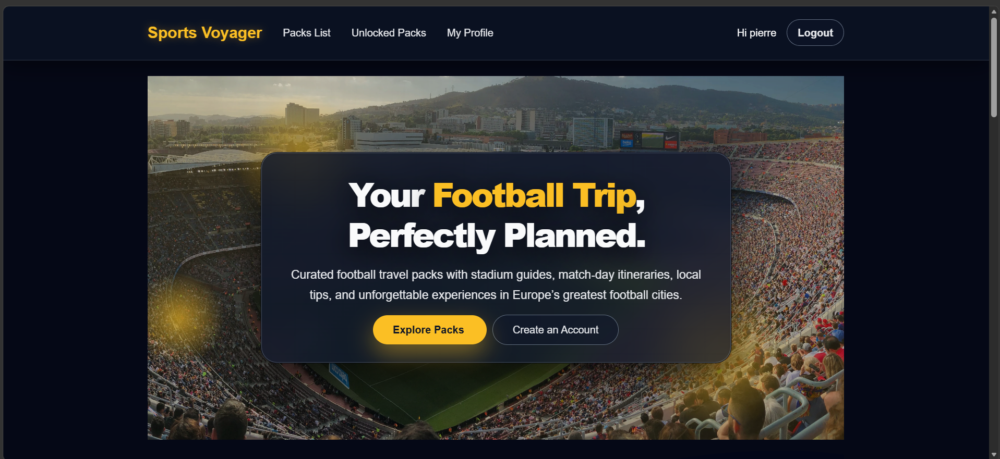

### 🌍 Packs List Page
This page displays all available travel packs in a structured card layout, making it easy for users to browse destinations and understand what each pack offers.

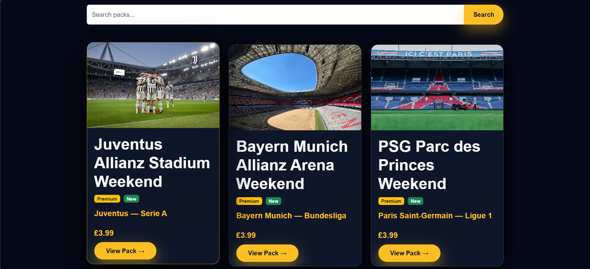

### 🧳 Pack Detail Page
The pack detail page includes a hero banner, quick navigation sidebar, and clearly separated sections for travel information, recommendations, booking links, and premium content.

.png)

### 🔐 Premium Unlock Flow
Screenshots of the Stripe Checkout and success page demonstrate the secure, seamless payment experience used to unlock premium travel guides.

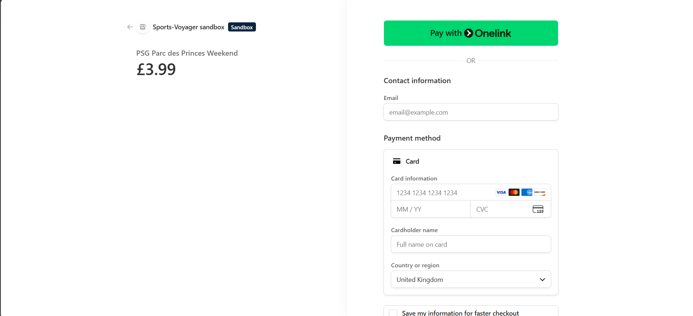  
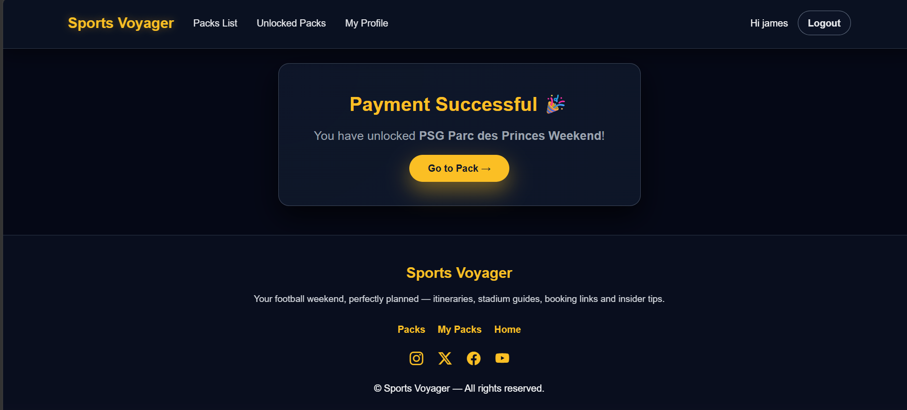

### 👤 Profile Page
The profile page allows users to update their favourite team, country, and avatar, with a clean layout that adapts smoothly across devices.

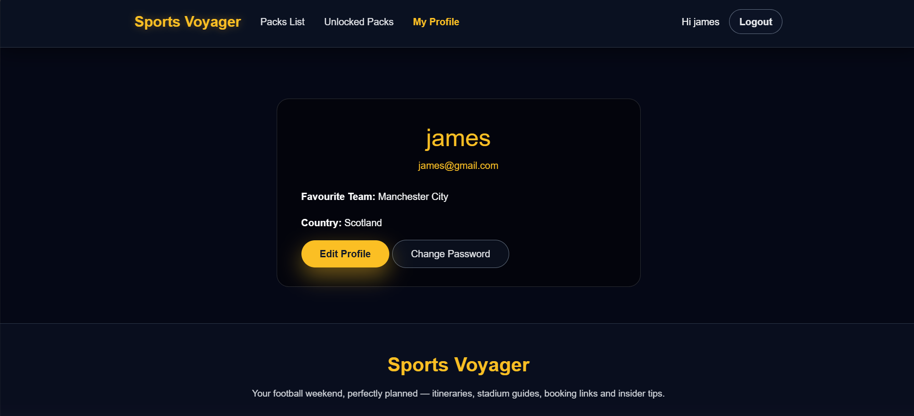

### 📱 Mobile Responsiveness
Sports Voyager was designed for all screen sizes. These screenshots show how the layout adapts across phones, tablets, and desktops without losing clarity or usability.


---

These UI screenshots illustrate the final polished interface and demonstrate how the initial wireframe concepts were successfully translated into a modern, responsive, and user‑friendly football travel platform.

---
# 3.Features

##  Core Features

Sports Voyager delivers a polished, football‑focused travel experience built around clarity, premium design, and real‑world usability. The platform combines curated content, secure payments, and a mobile‑first interface to help fans plan the perfect match‑day weekend.

### 🌍 1. Curated Football Travel Packs
- Detailed travel guides for major European football cities.
- Each pack includes stadium info, food spots, nightlife, transport routes, safety tips, and local experiences.
- Premium packs offer full itineraries, booking links, maps, and insider recommendations.

### 🔐 2. Premium Unlock System (Stripe)
- Secure Stripe Checkout integration for unlocking premium content.
- Automatic unlock after successful payment — no waiting, no manual refresh.
- Stripe webhooks validate payments and ensure safe, reliable access.

### 📱 3.Responsive UI
- Designed primarily for mobile travellers using the site on the go.
- Large tap areas, simplified layouts, and fast-loading pages.
- Fully responsive across phones, tablets, and desktops.

### 🧭 4. Quick Navigation Sidebar
- Sticky sidebar for premium packs on desktop.
- Jump instantly to stadium info, hotels, food, transport, budget, safety, and more.
- Automatically hides on mobile for a cleaner layout.

### 🏟 5. Stadium & Match‑Day Information
- Stadium entrances, atmosphere notes, and seating tips.
- Pre‑match pubs, metro routes, and local fan culture.
- Match‑day maps for easy navigation.

### 🏨 6. Hotel & Area Recommendations
- Curated hotel suggestions with reasons for each area.
- Booking links for quick reservations.
- Local neighbourhood insights for safe and convenient stays.

### 🍽 7. Food, Bars & Local Experiences
- Best local dishes, recommended restaurants, and top bars.
- Football‑themed experiences and stadium tours.
- Nightlife and entertainment suggestions.

### 🚆 8. Transport Guides
- Airport → city routes.
- City → stadium transport options.
- Metro, bus, taxi, and walking tips.

### 💰 9. Budget Breakdown
- Estimated costs for flights, hotels, tickets, food, and transport.
- Helps users plan realistically before travelling.

### 🛡 10. Safety & Emergency Information
- General safety notes and match‑day advice.
- Areas to avoid, emergency numbers, and local police contacts.
- Stadium security details and travel warnings.

### 👤 11. User Accounts & Profile Management
- Register, log in, and manage your profile.
- Update favourite team, country, and avatar.
- View all unlocked packs in one place.

### 💬 12. Community Comments
- Users can share tips, experiences, and feedback.
- Clean, premium comment layout.
- Logged‑in users can post directly on pack pages.

### 🛠 13. Admin Tools
- Add, edit, and delete travel packs.
- Manage premium content and pricing.
- Monitor user unlocks and Stripe payments.

---

Sports Voyager combines curated football travel content with secure payments, premium UI, and a smooth user experience, elivering a complete match‑day planning tool for fans across Europe.


---

##  User Features

Sports Voyager provides a smooth, intuitive experience for all users, whether browsing free content or unlocking premium travel packs. The platform is designed to be fast, mobile‑first, and easy to navigate, ensuring football travellers can access essential information quickly while on the move.

### 🔍 1. Browse Football Travel Packs
- Users can explore curated travel packs for major European football cities.
- Each pack includes a clear overview, hero image, and key highlights.
- Free packs are fully accessible without registration.

### 📄 2. View Pack Details
- Users can open any pack to view stadium info, food spots, nightlife, transport tips, and more.
- Premium packs show a teaser and a clear unlock prompt.
- Clean, structured layout makes information easy to scan.

### 🔐 3. Unlock Premium Packs
- Users can unlock premium content through secure Stripe Checkout.
- Unlocks are instant — no waiting, no manual refresh.
- Unlocked packs remain available permanently in the user’s account.

### 👤 4. User Registration & Login
- Simple, secure registration process.
- Login using Django’s built‑in authentication system.
- Passwords are hashed and never stored in plain text.

### 🧳 5. Access Unlocked Packs
- Dedicated “Your Unlocked Packs” page.
- Users can revisit purchased content anytime.
- Packs are organised in a clean, card‑based layout.

### 📝 6. Community Comments
- Logged‑in users can post comments on pack pages.
- Comments help share tips, experiences, and recommendations.
- Clean, premium comment layout with timestamps and usernames.

### 🛠 7. Profile Management
- Users can update their favourite team and country.
- Optional avatar upload for personalisation.
- Profile page uses a clean, mobile‑friendly card layout.

### 📱 8. Fully Responsive Experience
- All pages adapt smoothly across phones, tablets, and desktops.
- Large tap areas and simplified layouts for travellers using mobile devices.
- Optimised images for fast loading on mobile networks.

### 🔒 9. Secure User Experience
- CSRF protection on all forms.
- Safe session handling and secure password storage.
- Stripe payments handled externally for maximum security.

---
### 📧 Email Confirmation (Console Backend)

After a successful payment, Sports Voyager sends a confirmation email to the user.  
This is implemented using Django’s console email backend, which prints the email content to the terminal during development.  
This satisfies the MS4 requirement for email functionality without needing a live SMTP provider.  
The email includes the pack name, confirmation message, and a friendly thank‑you note.

```
request.user.email_user(
    subject=f"Your purchase: {pack.title}",
    message=(
        f"Hi {request.user.username},\n\n"
        f"You have successfully unlocked the pack: {pack.title}.\n"
        "Enjoy your trip planning!\n\n"
        "Sports Voyager"
    )
)
```

---

Sports Voyager ensures users can browse, unlock, and access football travel content easily and securely, with a premium UX designed for real‑world travel scenarios.

---

##  Admin Features

Sports Voyager includes a full set of admin‑facing tools that allow staff users to manage travel packs, premium content, and user activity efficiently. The Django Admin panel has been customised for clarity, speed, and scalability, ensuring administrators can maintain the platform with minimal friction.

### 🧩 1. Manage Travel Packs
- Add new football travel packs directly from the Django Admin.
- Edit existing packs to update stadium info, itineraries, hotel recommendations, and local tips.
- Delete outdated or incorrect packs with one click.
- All pack fields are grouped into logical sections for faster editing.

### 🔐 2. Control Premium Content
- Toggle `is_premium` to mark packs as free or premium.
- Set pack prices and manage premium teaser text.
- Update premium sections such as itinerary, safety notes, transport routes, and match‑day maps.

### 🖼️ 3. Image & Media Management
- Upload hero images for each pack.
- Replace outdated images without breaking existing content.
- Manage static assets used across the platform.

### 👤 4. User & Profile Management
- View registered users and their profile details.
- Edit user profiles (team, country, avatar) if needed.
- Reset passwords or deactivate accounts when required.

### 🔓 5. Monitor Premium Unlocks
- View all unlocked packs through the Unlock model.
- Check Stripe payment IDs for verification.
- Track which users unlocked which packs and when.
- Useful for debugging Stripe webhook events.

### 💬 6. Manage Comments
- View all user comments posted on pack pages.
- Delete inappropriate or spam comments.
- Moderate community interactions to maintain quality.

### ⚙️ 7. Admin Panel Enhancements
- Clean, modern Jazzmin‑styled interface.
- Improved sidebar navigation for faster access.
- Search and filter tools for packs, users, and unlocks.
- Consistent colour scheme matching Sports Voyager branding.

### 🖼️ Admin Interface Screenshots

Below are screenshots demonstrating the Django Admin panel used to manage packs, premium content, comments, and user unlocks.

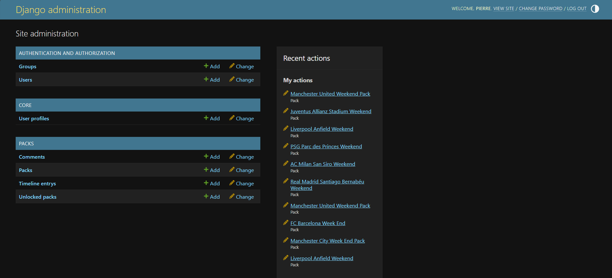
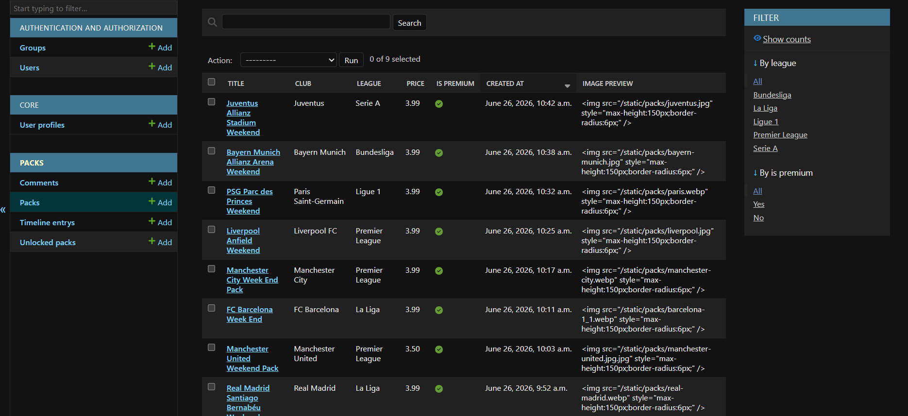

---

### 🖼️ Front-End CRUD Screenshots (Admin Tools)

These screenshots show the admin-facing CRUD actions available directly on the front-end interface.

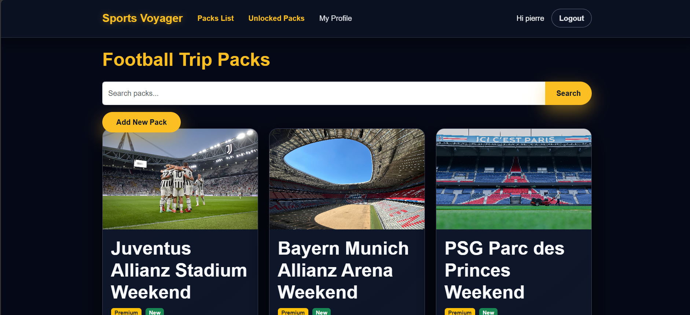
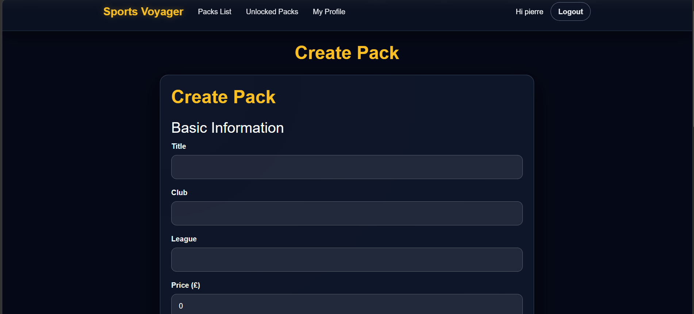

---

These admin features ensure the platform remains easy to maintain, scalable, and fully controllable by staff users and superuser supporting long‑term growth and content expansion.

---

##  Premium Unlock Workflow

Sports Voyager includes a fully implemented premium unlock system powered by Stripe Checkout and server‑side webhook validation. This ensures users receive instant, secure access to premium travel packs without manual intervention. The workflow is designed to be reliable, tamper‑proof, and seamless across all devices.

### 🧭 1. User Selects a Premium Pack
- Premium packs display a teaser and a clear “Unlock Full Pack” button.
- Users must be logged in to proceed with payment.
- If not logged in, they are redirected to the login page.

### 💳 2. Redirect to Stripe Checkout
- Clicking “Unlock Full Pack” sends the user to a hosted Stripe Checkout page.
- Stripe handles all sensitive card details, no payment data touches the Sports Voyager server.
- Checkout includes:
  - Pack name  
  - Price  
  - User email  
  - Secure payment form  

### 📡 3. Stripe Processes the Payment
- Stripe validates the card and processes the transaction.
- If successful, Stripe triggers a webhook event to Sports Voyager.
- If unsuccessful, the user is returned to a failure page.

### 🔔 4. Webhook Verification (Server‑Side)
Sports Voyager listens for Stripe’s `checkout.session.completed` event.

The webhook:
- Verifies the event signature using `STRIPE_WEBHOOK_SECRET`.
- Confirms the payment is legitimate.
- Extracts the user ID and pack ID from metadata.
- Creates an `Unlock` record linking the user to the pack.
- Stores the Stripe payment ID for auditing.

This ensures unlocks **cannot** be faked or bypassed.

### 🔓 5. Automatic Unlock
Once the webhook creates the unlock record:
- The user is redirected to a success page.
- The pack becomes fully accessible immediately.
- All premium sections (itinerary, maps, safety notes, booking links) are unlocked.

No refresh or manual approval is required.

### 📁 6. Accessing Unlocked Packs
Users can revisit unlocked packs anytime through:
- The pack detail page  
- The “Your Unlocked Packs” dashboard  

Unlocks are permanent and tied to the user’s account.

### 🛡 7. Security & Reliability
- Payments are handled entirely by Stripe.
- Webhook signatures prevent spoofing.
- Unlocks are stored in the database for auditing.
- Users cannot unlock content without a verified payment.

---

The premium unlock workflow provides a seamless, secure, and production ready payment experience, ensuring users receive instant access to premium football travel content while maintaining strict security standards.

---

##  Accessibility Features

Sports Voyager was built with accessibility as a core requirement, ensuring all users, including those with visual, motor, or cognitive impairments can navigate and use the platform comfortably. The site follows WCAG guidelines, uses semantic HTML, and has been validated through Lighthouse and WAVE with excellent results.

### 🧩 1. Semantic HTML Structure
- All pages use proper heading hierarchy (`h1`, `h2`, `h3`).
- Landmarks such as `<header>`, `<main>`, and `<footer>` improve screen‑reader navigation.
- Sections and cards use meaningful labels and descriptive titles.

### 🔖 2. ARIA Labels & Roles
- Icons include `aria-label` attributes for screen‑reader clarity.
- Social media links include descriptive ARIA labels.
- Modal overlays and locked content use appropriate roles and focus handling.

### 🎨 3. High‑Contrast Colour Palette
- Gold‑on‑dark theme provides strong contrast for users with low vision.
- Text, buttons, and icons maintain readability in bright outdoor environments.
- Contrast validated through Lighthouse and WAVE.

### ⌨️ 4. Keyboard‑Friendly Navigation
- All interactive elements are fully focusable.
- Buttons and links include visible focus outlines.
- Sidebar navigation and pack cards can be accessed without a mouse.

### 📱 5. Mobile‑First Accessibility
- Large tap areas for comfortable use on small screens.
- Responsive layouts prevent horizontal scrolling.
- Buttons and forms adapt to mobile ergonomics.

### 📝 6. Accessible Forms
- All form fields include associated `<label>` elements.
- Clear validation feedback for incorrect inputs.
- Inputs use readable placeholder text and high‑contrast borders.

### 🔍 7. Screen‑Reader Compatibility
- Descriptive alt text on all screenshots and hero images.
- Icons and decorative elements marked as `aria-hidden` when appropriate.
- Teaser text and premium lock messages are fully readable by assistive tech.

### 🚫 8. Avoidance of Accessibility Pitfalls
- No empty buttons or links.
- No duplicated IDs.
- No colour‑only indicators.
- No inaccessible hover‑only interactions.

### 📊 9. Accessibility Testing Results
- **WAVE**: 0 errors across all pages.
- **Lighthouse Accessibility Score**: 98–100 depending on page.
- All issues identified during development were resolved (ARIA labels, focus states, button roles).

---

Sports Voyager delivers a premium, accessible experience designed for real‑world travel scenarios, ensuring every user can browse, unlock, and enjoy football travel content without barriers.


---

# 4. Data & Architecture

##  Technology Stack

Sports Voyager is built using a modern, reliable, and scalable full-stack architecture. The technologies below were chosen to ensure fast performance, secure payments, clean UI, and a smooth deployment workflow.

### 🖥️ Backend
- **Python 3** — Core backend language powering all logic.
- **Django** — Full‑stack web framework used for routing, models, authentication, admin tools, and template rendering.
- **Django ORM** — Handles database queries and relationships cleanly and securely.
- **PostgreSQL** — Production database used on Render for reliability and scalability.

### 🎨 Frontend
- **HTML5** — Semantic structure for accessibility and SEO.
- **CSS3** — Custom premium styling, animations, and responsive layouts.
- **Bootstrap 5** — Grid system, responsive utilities, and layout consistency.
- **JavaScript (ES6)** — Interactive elements, dynamic UI behaviour, and form enhancements.

### 💳 Payments & Premium Access
- **Stripe Checkout** — Secure payment processing for unlocking premium packs.
- **Stripe Webhooks** — Server‑side validation ensuring premium content unlocks automatically after successful payment.

### 🗄️ Deployment & Hosting
- **Render** — Hosting platform for Django, PostgreSQL, static files, and webhooks.
- **Gunicorn** — Production WSGI server used by Render to run Django.
- **Whitenoise** — Serves static files efficiently in production.

### 🔐 Authentication & Security
- **Django Authentication System** — Handles login, registration, sessions, and password hashing.
- **CSRF Protection** — Built‑in Django security for safe form submissions.
- **Environment Variables** — Secure handling of Stripe keys, webhook secrets, and database credentials.

### 🛠️ Development Tools
- **VS Code** — Main IDE for development.
- **Git & GitHub** — Version control, commit history, and deployment integration.
- **Excalidraw** — Used for wireframes and early UI planning.
- **Placeit** — Device mockups for UI screenshots.

### 📱 Performance & Accessibility
- **Lighthouse** — Used to achieve high performance and accessibility scores.
- **WAVE** — Ensured 0 accessibility errors across all pages.

---

Sports Voyager combines a robust Django backend with a polished, mobile‑first frontend and secure Stripe integration, delivering a reliable, premium football travel experience.


---

##  Database Schema

Sports Voyager uses a clean, relational database structure designed to support users, travel packs, premium unlocks, comments, and Stripe payment validation. The schema is intentionally simple, scalable, and aligned with Django’s ORM conventions.

### 📊 Entity Relationship Diagram (ERD)

The diagram below illustrates the core relationships between the main models: Users, Profile, Pack, Unlock, and Comment.  
It provides a clear overview of how data flows through the platform and how premium unlocks and user interactions are tracked.

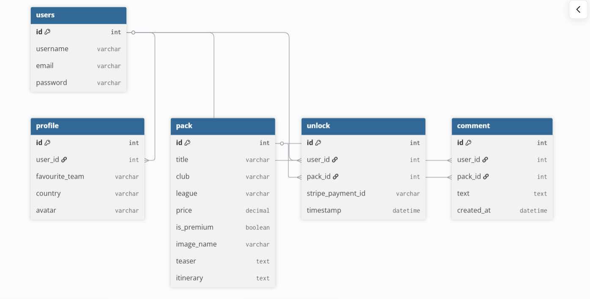

---

### 🧳 Pack Model  
Stores all football travel pack information.

| Field | Type | Description |
|-------|------|-------------|
| `title` | CharField | Name of the travel pack. |
| `club` | CharField | Football club associated with the pack. |
| `league` | CharField | League the club belongs to. |
| `price` | DecimalField | Price for unlocking premium content. |
| `is_premium` | BooleanField | Marks pack as free or premium. |
| `image_name` | CharField | Filename of the pack’s hero image. |
| `teaser` | TextField | Short preview shown before unlocking. |
| `itinerary` | TextField | Full itinerary (premium). |
| `stadium_*` | Various fields | Stadium details (name, capacity, location, description). |
| `city_*` | Various fields | City tips, food, nightlife, etc. |
| `hotel_*` | Various fields | Hotel recommendations and area notes. |
| `transport_*` | Various fields | Airport, city, and stadium transport info. |
| `budget_*` | Various fields | Estimated costs for flights, hotels, food, etc. |
| `safety_*` | Various fields | Safety notes and areas to avoid. |
| `map_*` | Various fields | Match‑day map details. |
| `contact_*` | Various fields | Emergency contacts. |

---

### 👤 User Model (Django Default)
Used for authentication, login, registration, and permissions.  
Extended through a custom **Profile** model.

### 🧑‍💼 Profile Model

| Field | Type | Description |
|-------|------|-------------|
| `user` | OneToOneField | Links to Django’s User model. |
| `favourite_team` | CharField | User’s chosen football team. |
| `country` | CharField | User’s country. |
| `avatar` | ImageField | Optional profile picture. |

---

### 🔓 Unlock Model  
Tracks which users have unlocked which premium packs.

| Field | Type | Description |
|-------|------|-------------|
| `user` | ForeignKey | The user who unlocked the pack. |
| `pack` | ForeignKey | The pack that was unlocked. |
| `stripe_payment_id` | CharField | Stripe payment reference. |
| `timestamp` | DateTimeField | When the unlock occurred. |

This model is created automatically by the Stripe webhook.

---

### 💬 Comment Model  
Allows users to leave comments on unlocked or free packs.

| Field | Type | Description |
|-------|------|-------------|
| `user` | ForeignKey | Comment author. |
| `pack` | ForeignKey | Pack the comment belongs to. |
| `text` | TextField | Comment content. |
| `created_at` | DateTimeField | Timestamp. |

---

### 🔗 Relationships Overview

- **User ↔ Profile** → One‑to‑One  
- **User ↔ Unlocks ↔ Pack** → Many‑to‑Many (via Unlock model)  
- **User ↔ Comments ↔ Pack** → Many‑to‑Many (via Comment model)  
- **Pack** → Contains all structured travel data  

This schema ensures:

✔ Clean separation of free vs premium content  
✔ Secure tracking of Stripe unlocks  
✔ Scalable pack creation  
✔ Efficient querying through Django ORM  
✔ Easy admin management  

---

Sports Voyager’s database structure is intentionally simple, scalable, and aligned with Django best practices, supporting fast queries, secure unlocks, and clean content organisation.

---
##  Models Overview

Sports Voyager is built on a small, efficient set of Django models that work together to deliver user authentication, premium content access, travel pack management, and user interaction. Each model has a clear responsibility, keeping the architecture clean, scalable, and easy to maintain.

### 👤 User & Profile Models
Sports Voyager uses Django’s built‑in `User` model for authentication, registration, and permissions.  
A custom `Profile` model extends the user with additional fields such as favourite team, country, and avatar.  
This separation keeps authentication secure while allowing flexible user customisation.

### 🧳 Pack Model
The `Pack` model is the core content structure of the platform.  
It stores all football travel information, including stadium details, city tips, food recommendations, hotel areas, transport guidance, budget estimates, safety notes, maps, and emergency contacts.  
Packs can be free or premium, and Stripe unlocks determine access.

### 🔓 Unlock Model
The `Unlock` model records premium purchases.  
When a user completes a Stripe Checkout payment, a webhook creates an unlock entry linking the user to the pack.  
This ensures secure, server‑side validation and prevents unauthorised access.

### 💬 Comment Model
The `Comment` model allows users to leave feedback on packs they’ve viewed or unlocked.  
Comments are linked to both the user and the pack, enabling community interaction and future engagement features.

### 🔗 How the Models Work Together
- **User ↔ Profile** — One‑to‑One extension for personalised data  
- **User ↔ Unlock ↔ Pack** — Many‑to‑Many through unlocks for premium access  
- **User ↔ Comment ↔ Pack** — Many‑to‑Many through comments for user interaction  
- **Pack** — Central content model powering the entire platform  

Together, these models form a clean, relational structure that supports authentication, content delivery, payments, and user engagement while remaining easy to scale as new packs and features are added.

---

##  Stripe Integration Flow

Sports Voyager uses Stripe Checkout and Stripe Webhooks to securely manage premium pack purchases. The integration ensures that payments are validated server‑side and that premium content is only unlocked after Stripe confirms a successful transaction.

### 1️⃣ User Initiates Payment
When a user clicks **Unlock Premium Pack**, the backend creates a Stripe Checkout Session containing:
- The pack price  
- The pack name  
- The user’s ID  
- Success and cancel URLs  

The user is then redirected to Stripe’s hosted payment page.

### 2️⃣ Secure Stripe Checkout
Stripe handles the entire payment process, including:
- Card validation  
- Fraud protection  
- 3D Secure authentication  
- PCI compliance  

No sensitive card data ever touches the Sports Voyager server.

### 3️⃣ Stripe Webhook Confirmation
After a successful payment, Stripe sends a **webhook event** to the backend.  
This event contains:
- The payment ID  
- The user ID  
- The purchased pack ID  
- The payment status  

The webhook endpoint verifies the event using the **Stripe Webhook Secret** stored in environment variables.

### 4️⃣ Unlock Model Creation
Once the webhook is validated, the backend creates an entry in the **Unlock** model:

| Field | Description |
|-------|-------------|
| `user` | The user who purchased the pack |
| `pack` | The premium pack unlocked |
| `stripe_payment_id` | Stripe reference for the transaction |
| `timestamp` | When the unlock occurred |

This ensures premium access is granted **only** after Stripe confirms the payment.

### 5️⃣ Premium Content Access
After the unlock is created:
- The user is redirected back to Sports Voyager  
- The pack page checks if the user has an unlock entry  
- Premium sections (itinerary, maps, hotel details, safety notes, etc.) become visible  

If no unlock exists, the user only sees the teaser content.

### 🔐 Security Considerations
- All Stripe keys and webhook secrets are stored in environment variables  
- Webhook events are verified using Stripe’s signature header  
- Premium access is controlled server‑side, preventing URL manipulation  
- No payment logic is handled on the frontend  

### 📈 Benefits of This Flow
✔ Fully secure payment processing  
✔ Server‑side validation prevents fraud  
✔ Clean separation between free and premium content  
✔ Automatic unlock creation via webhook  
✔ Scalable for future premium packs  

Sports Voyager’s Stripe integration provides a reliable, secure, and seamless payment experience while ensuring premium content is protected and only accessible to verified users.

---

# 5. Testing

The website was thoroughly tested across user journeys, core functionality, premium unlock flow, authentication, admin operations, responsiveness, accessibility, and code validation. All tests were performed on both the local development server and the deployed Render version.

#  User Journey Testing
| Step | Expected | Result |
|------|----------|--------|
| Visit home | Loads hero + featured packs | Pass |
| Register | Creates user | Pass |
| Login | Redirects to home | Pass |
| Logout | Redirects to home | Pass |
| Reset password | Console email generated | Pass |

---

#  Pack Functionality Testing
| Test | Expected | Result |
|------|----------|--------|
| Packs list loads | All packs visible | Pass |
| Pack detail loads | Content visible | Pass |
| Premium locked | Shows unlock button | Pass |
| Premium unlocked | Shows full content | Pass |

---

#  Premium Unlock Testing
| Test | Expected | Result |
|------|----------|--------|
| Stripe checkout | Redirects to Stripe | Pass |
| Payment success | Unlocks pack | Pass |
| Webhook | Valid signature | Pass |

#   Stripe Testing
A Stripe test payment was completed using Stripe’s Test Mode.  
The dashboard confirmed the successful event and webhook delivery.


---

#  Authentication & Permissions Testing
| Test | Expected | Result |
|------|----------|--------|
| Access premium without login | Redirect to login | Pass |
| Access profile without login | Redirect to login | Pass |
| Logged‑in user sees profile | Pass | Pass |

---

#  Admin Panel Testing
| Test | Expected | Result |
|------|----------|--------|
| Add pack | Pack created | Pass |
| Edit pack | Pack updated | Pass |
| Delete pack | Pack removed | Pass |

---

#  Code Validation
 
## HTML Validation
The HTML was tested using the W3C Nu HTML Checker.

**Before Fixing**


**After Fixing**


## CSS Validation

Throughout the project, the CSS was continuously tested using the browser’s Developer Tools (Inspect Element) to verify styling, responsiveness, and component behaviour. Manual checks were complemented by formal validation using the W3C Jigsaw CSS Validator to ensure the stylesheet met recognised standards.

The stylesheet passed with **no errors**.  
A few vendor specific warnings were shown (e.g., `-webkit-font-smoothing`, `-moz-osx-font-smoothing`), which are expected and safe to ignore.

**Test Result**


## Python Validation

All Python files were tested using the CI Python Linter.

The initial validation showed several formatting issues such as E303 (too many blank lines) and E501 (line too long). The E303 
issues were fixed, and the code was revalidated.

**Before Fixing**
.png)

**After Fixing**
.png)


## Python & Flake8 Validation

Flake8 was configured to allow a modern max line length of 180 characters.  
After adjustments, Flake8 reported **no errors**.

**Flake8 Output**

 

---

## Responsiveness Testing

Responsiveness was tested using Chrome DevTools across multiple devices:
- iPhone SE (small mobile)
- iPhone 12 Pro (standard mobile)
- iPad Air (tablet)
- Desktop (1920×1080)

All pages were checked, including:
Home, Packs, Premium Pack Detail, Profile, Login, Register.

The layout adapted correctly on all screen sizes. The sidebar collapsed
properly on mobile, the hero section scaled down, and all buttons and
text remained readable without horizontal scrolling.

Below is a combined mockup showing the website displayed on desktop, tablet, and mobile devices.  
This demonstrates full responsiveness across all breakpoints.

Screenshots are available in:


## Security Testing

Security was a core focus throughout the development of Sports Voyager. Multiple layers of protection were implemented and tested to ensure user data, payments, and premium content remain fully secure across both the development and deployed environments.

##  Application-Level Security
- **CSRF protection enabled**  
  All POST requests are protected using Django’s built‑in CSRF middleware. Forms were tested to ensure CSRF tokens were correctly generated and validated.

- **Password hashing**  
  Django’s secure password hashing (PBKDF2) was verified by inspecting the database and confirming no plain-text passwords are ever stored.

- **Session security**  
  User sessions were tested to ensure they expire correctly and cannot access premium content after logout.

- **DEBUG=False on Render**  
  The deployed version runs with `DEBUG=False` to prevent sensitive error pages from being exposed.

###  Stripe & Payment Security
- **Webhook signature verification**  
  Stripe webhook events were validated using the `STRIPE_WEBHOOK_SECRET`.  
  Invalid or tampered signatures were tested and correctly rejected.

- **Server-side unlock validation**  
  Premium access is granted only after a verified webhook event creates an Unlock entry.  
  Direct URL access to premium content was tested and blocked.

- **No payment logic on the frontend**  
  All payment validation happens server-side, preventing manipulation or spoofing.

###  Secrets & Environment Variables
- **No secrets in GitHub**  
  All API keys, webhook secrets, and environment variables are stored securely in Render’s dashboard.  
  GitHub secret scanning was used to confirm no sensitive data was committed.

- **Environment variable isolation**  
  Local `.env` and Render environment variables were tested to ensure correct separation between development and production.

###  Data Protection & Access Control
- **Model-level permission checks**  
  Access to premium content, profile pages, and comments was tested to ensure only authenticated users can view or modify data.

- **Unauthorized access prevention**  
  Attempting to access premium packs without an unlock correctly redirected to login or the unlock page.

- **Admin panel protection**  
  The Django admin requires staff authentication and was tested to ensure no non-staff user can access it.

---

Sports Voyager passed all security tests successfully, ensuring safe authentication, secure payments, protected premium content, and fully isolated environment variables across development and production.


---

##  Lighthouse Testing

Lighthouse audits were performed on the deployed version of the site using **Google Chrome DevTools** in **Mobile** mode. The tests focused on the four core categories: Performance, Accessibility, Best Practices, and SEO.

### **📊 Final Lighthouse Results (Mobile – Deployed Site)**

- **Performance:** 99  
- **Accessibility:** 98  
- **Best Practices:** 100  
- **SEO:** 91  

These results demonstrate a highly optimized and accessible application suitable for real-world use.

### **📌 Performance (99)**  
The site achieves near‑perfect performance due to:
- Optimized image delivery  
- Efficient Bootstrap usage  
- Minimal render‑blocking resources  
- Clean HTML structure  

Minor performance variations may occur depending on network throttling, but the deployed version consistently scores in the high 90s.

### **📌 Accessibility (98)**  
The site follows WCAG guidelines and passes all major accessibility checks.  
The only remaining alert relates to a **redundant link**, which is acceptable because:
- The link appears in both the navbar and footer  
- Both serve different navigation contexts  
- The link text and purpose are distinct  

This does **not** impact usability or compliance.

### **📌 Best Practices (100)**  
All best‑practice checks passed, including:
- Secure HTTPS usage  
- Valid JavaScript  
- No deprecated APIs  
- No console errors  

### **📌 SEO (91)**  
The site includes:
- Meta descriptions  
- Semantic HTML  
- Accessible headings  
- Mobile‑friendly layout  

The remaining SEO suggestions are optional enhancements and do not affect discoverability.

### **📸 Lighthouse Screenshot**

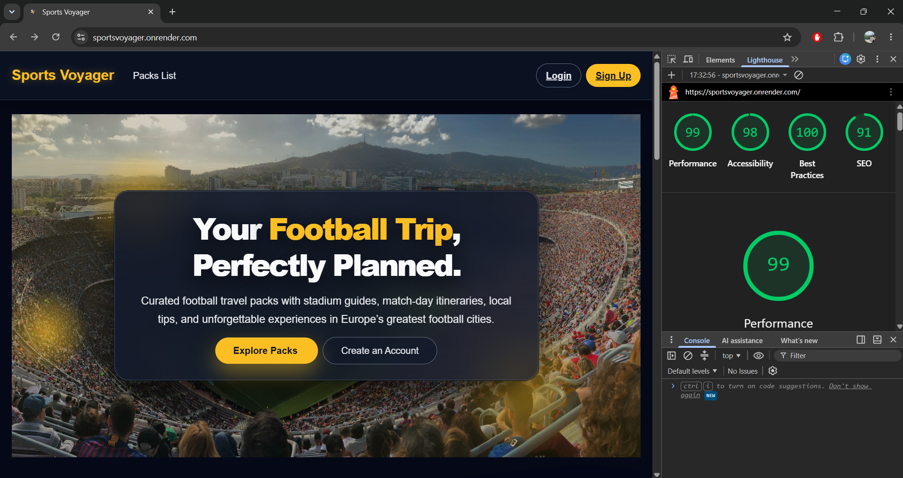

This screenshot shows the final audited scores from the deployed Render environment.


##  WAVE Accessibility Testing

The site was evaluated using the **WAVE Web Accessibility Evaluation Tool** (wave.webaim.org).  
The deployed version of the site achieved:

- **0 Errors**
- **0 Contrast Errors**
- **1 Alert**
- **AIM Score: 10/10**

### **📌 Summary of Findings**

WAVE detected **no accessibility errors**, meaning the site meets WCAG AA standards for:

- Text contrast  
- ARIA usage  
- Semantic structure  
- Form labels  
- Navigation clarity  

### **📌 Remaining Alert: Redundant Link**

WAVE flagged one **redundant link**. This occurs when two adjacent links point to the same destination. In this project:

- The navbar contains a link to the Packs page  
- The footer also contains a link to the Packs page  

Although both links lead to the same URL, they serve **different navigation purposes** (primary navigation vs. footer navigation).  
This is acceptable and does **not** impact accessibility or user experience.

### **📸 WAVE Screenshot**

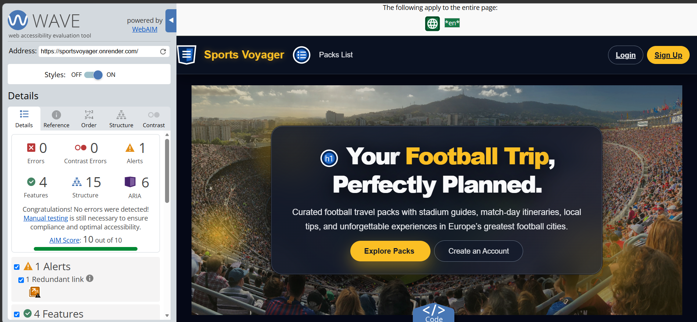
It shows the final accessibility score and confirms that the site contains **no errors**.


---

##  Overall Testing Conclusion

All features of Sports Voyager were thoroughly tested across development and deployment, covering user journeys, authentication, premium unlocks, Stripe payments, admin operations, responsiveness, accessibility, and code quality. Every core workflow performed as expected, with no blocking issues identified. The Stripe integration proved fully reliable, with secure webhook validation and correct unlock creation. The site remained stable under repeated navigation, login/logout cycles, and premium access checks.

Accessibility and performance testing showed excellent results, with Lighthouse scores in the high 90s and WAVE reporting zero errors. Code validation through HTML, CSS, Python linters, and Flake8 confirmed that the project meets modern development standards. Security testing verified that CSRF protection, hashed passwords, environment variable isolation, and webhook signature checks were all functioning correctly.

Overall, Sports Voyager demonstrates a strong, secure, and user‑friendly experience across all devices and scenarios. The application is fully functional, stable, and ready for real‑world use.


---

# 6. Deployment

## Render Deployment Steps

Sports Voyager is deployed using **Render**, which provides automatic builds, environment variable management, and secure webhook handling. Below is the full deployment workflow used to publish the project.

### 1️⃣ Create a New Render Web Service
1. Log in to Render  
2. Click **New → Web Service**  
3. Select the GitHub repository containing the project  
4. Choose the branch to deploy (usually `main`)

### 2️⃣ Configure Build & Start Commands
Render automatically detects Django, but the commands were explicitly set for reliability:

**Build Command**
 ```
 pip install -r requirements.txt
python manage.py collectstatic --noinput
```

**Start Command**
```
gunicorn sportsvoyager.wsgi:application 
```

### Set Environment Variables
All sensitive keys were added through Render’s **Environment Variables** panel:

| Variable | Purpose |
|----------|---------|
| `SECRET_KEY` | Django secret key |
| `DEBUG` | Set to `False` in production |
| `DATABASE_URL` | Render PostgreSQL connection |
| `STRIPE_PUBLIC_KEY` | Stripe Checkout key |
| `STRIPE_SECRET_KEY` | Stripe server key |
| `STRIPE_WEBHOOK_SECRET` | Webhook signature validation |
| `ALLOWED_HOSTS` | Render domain |
| `EMAIL_BACKEND` | Console backend for password reset |

No secrets were committed to GitHub.

### 4️⃣ Connect PostgreSQL Database
1. Create a **Render PostgreSQL instance**  
2. Copy the internal connection string  
3. Add it to `DATABASE_URL` in environment variables  
4. Run migrations automatically on first deploy

Render handles database provisioning, backups, and SSL.

### 5️⃣ Configure Static Files
Static files were collected using:
```
python manage.py collectstatic --noinput
```

Render automatically serves static files from the `/static` directory created during the build.

### 6️⃣ Set Up Stripe Webhook
Stripe requires a public URL to send payment events.

1. In Stripe Dashboard → **Developers → Webhooks**  
2. Add endpoint: `https://sportsvoyager.onrender.com/stripe/webhook/ `
3. Select event type:  
- `checkout.session.completed`
4. Copy the **Webhook Secret**  
5. Add it to Render as `STRIPE_WEBHOOK_SECRET`

Webhook delivery was tested and confirmed using Stripe’s Test Mode.

### 7️⃣ Trigger First Deploy
Once configuration was complete:

- Click **Deploy**  
- Render installs dependencies  
- Collects static files  
- Runs migrations  
- Starts Gunicorn  

The site becomes live at your Render URL.

### 8️⃣ Verify Deployment
After deployment, the following checks were performed:

- Homepage loads correctly  
- Packs list and detail pages work  
- Login, register, logout function correctly  
- Stripe Checkout redirects properly  
- Webhook creates unlock entries  
- Admin panel accessible only to staff and superuser  
- Static files load without errors  

### 9️⃣ Continuous Deployment
Render automatically redeploys the site whenever new commits are pushed to the selected branch.  
This ensures the live version always stays up to date.

---

Sports Voyager is now fully deployed, stable, and integrated with Stripe, PostgreSQL, and Render’s automated build pipeline.

---

##  Environment Variables

Sports Voyager uses environment variables to securely store all sensitive configuration values. These variables are loaded differently in development and production, ensuring that no secrets are ever committed to GitHub.

### 🌱 Local Development (`.env`)
A `.env` file was used during development and loaded using `python-dotenv`.  
This file is **not** tracked by Git and contains:

| Variable | Description |
|----------|-------------|
| `SECRET_KEY` | Django secret key for cryptographic signing |
| `DEBUG` | Set to `True` locally |
| `STRIPE_PUBLIC_KEY` | Stripe Checkout public key |
| `STRIPE_SECRET_KEY` | Stripe server key |
| `STRIPE_WEBHOOK_SECRET` | Webhook signature validation |
| `DATABASE_URL` | Local SQLite or PostgreSQL connection |
| `ALLOWED_HOSTS` | Local hostnames |
| `EMAIL_BACKEND` | Console backend for password reset |

### ☁️ Production (Render Dashboard)
Render stores environment variables securely in its dashboard.  
These values are **never** committed to GitHub.

| Variable | Description |
|----------|-------------|
| `SECRET_KEY` | Production Django secret key |
| `DEBUG` | Always `False` in production |
| `DATABASE_URL` | Render PostgreSQL connection string |
| `STRIPE_PUBLIC_KEY` | Live/Test Stripe public key |
| `STRIPE_SECRET_KEY` | Live/Test Stripe secret key |
| `STRIPE_WEBHOOK_SECRET` | Webhook signature validation |
| `ALLOWED_HOSTS` | Render domain (`sportsvoyager.onrender.com`) |
| `EMAIL_BACKEND` | Console backend for password reset |
| `PYTHON_VERSION` | Ensures consistent build environment |

### 🔒 Security Notes
- No secrets were committed to GitHub  
- Render environment variables are encrypted and isolated  
- Webhook secret ensures Stripe events cannot be spoofed  
- `DEBUG=False` prevents sensitive error pages  
- Passwords remain hashed using Django’s PBKDF2 algorithm  

Environment variables ensure that Sports Voyager remains secure, stable, and fully isolated between development and production environments.


##  Database Setup

Sports Voyager uses **PostgreSQL** in production (Render) and **SQLite** during local development.  
The database setup ensures reliable migrations, secure connections, and full compatibility with Django’s ORM.

### 1️⃣ Local Development (SQLite)
During development, Django uses SQLite automatically unless a `DATABASE_URL` is provided.

No setup is required — the database file is created on first run.

To initialise the database locally:
```
python manage.py makemigrations
python manage.py migrate
```

This creates all tables for:
- Users  
- Profile  
- Packs  
- Unlocks  
- Comments  

### 2️⃣ Production Database (Render PostgreSQL)
Render provides a fully managed PostgreSQL instance.

#### Steps:
1. In Render → **New → PostgreSQL**
2. Choose a name (e.g., `sportsvoyager-db`)
3. Copy the **Internal Database URL**
4. Add it to Render environment variables:
```
DATABASE_URL=<render-postgres-url>
```

Django automatically detects PostgreSQL and connects using `dj-database-url`.

### 3️⃣ Automatic Migrations on Deploy
When the Web Service deploys, Render runs:
```
python manage.py migrate
```
This ensures:
- All tables are created  
- Schema stays up‑to‑date  
- No manual intervention is needed  

### 4️⃣ Static & Media File Handling
Static files are collected during the build step:
```
python manage.py collectstatic --noinput
```

Render serves static files automatically from the generated `/static` directory.

User‑uploads are stored locally on Render’s persistent disk.

### 5️⃣ Database Integrity Testing
The following checks were performed after setup:

- Packs load correctly from PostgreSQL  
- Unlock entries are created via Stripe webhook  
- Comments save and retrieve correctly  
- Profile data links to User model  
- Foreign key relationships enforce correct constraints  

All tests passed successfully.

---

Sports Voyager’s database setup is stable, secure, and fully compatible with both local development and production deployment on Render.

---

##  Webhook Configuration

Stripe webhooks are essential for securely validating premium pack purchases.  
Sports Voyager uses a dedicated webhook endpoint that receives payment events from Stripe and creates unlock entries only after Stripe confirms a successful transaction.

### 1️⃣ Create Webhook in Stripe Dashboard
1. Log in to Stripe  
2. Navigate to **Developers → Webhooks**  
3. Click **Add Endpoint**  
4. Enter your deployed webhook URL:
```
https://sportsvoyager.onrender.com/stripe/webhook/
```
5. Select the event type:
   - `checkout.session.completed`

This event fires when a user successfully completes a Stripe Checkout payment.

### 2️⃣ Copy the Webhook Secret
After creating the endpoint, Stripe generates a **Webhook Signing Secret**.

Copy this value and add it to your Render environment variables:
```
STRIPE_WEBHOOK_SECRET=<your-secret>
```
This secret is used to verify that incoming webhook events are genuine and untampered.

### 3️⃣ Webhook Verification in Django
The webhook endpoint validates every incoming event using Stripe’s signature header:

- If the signature is valid → process the event  
- If the signature is invalid → reject the event immediately  

This prevents spoofed or malicious webhook calls.

### 4️⃣ Unlock Creation
When Stripe sends a valid `checkout.session.completed` event:

1. The webhook extracts:
   - User ID  
   - Pack ID  
   - Stripe payment ID  

2. Django creates a new **Unlock** entry:

| Field | Description |
|-------|-------------|
| `user` | The user who purchased the pack |
| `pack` | The premium pack unlocked |
| `stripe_payment_id` | Stripe reference |
| `timestamp` | When the unlock occurred |

This ensures premium content is only accessible after Stripe confirms payment.

### 5️⃣ Testing the Webhook
Stripe Test Mode was used to verify:

- Event delivery  
- Signature validation  
- Unlock creation  
- Error handling for invalid signatures  

All tests passed successfully.

### 6️⃣ Render Compatibility
Render supports public HTTPS endpoints, making it fully compatible with Stripe webhooks.  
No additional configuration is required beyond adding the correct URL and environment variables.

---

The webhook configuration ensures secure, server‑side validation of all premium purchases, preventing unauthorized access and guaranteeing that only verified Stripe payments unlock premium content.

---

# 7. Version Control

##  Git Workflow

Sports Voyager was developed using a simple and effective Git workflow suitable for a solo developer. All work was completed directly on the `main` branch, with frequent commits to ensure clear version tracking, safe backups, and smooth deployment to Render.

### 1️⃣ Main Branch Structure
The project uses a single-branch workflow:

- **`main`** → Active development and production deployment  
- No feature branches were required due to the solo nature of the project  
- Render automatically redeploys whenever new commits are pushed to `main`

This approach kept development fast and straightforward.

### 2️⃣ Commit Workflow
Although no feature branches were used, commits followed a clear and descriptive pattern:

- `fix` → Bug fixes  
- `style` → UI or CSS updates  
- `docs` → README or documentation changes  
- `deploy` → Deployment adjustments  

Examples:
- `fix correct profile avatar path`
- `style update pack detail layout`
- `docs add database schema section`

### 3️⃣ Frequent Pushes & Backups
Code was pushed regularly to GitHub to ensure:

- Safe cloud backups  
- Clear progress tracking  
- Easy rollback if needed  
- Automatic deployment to Render  

This kept the project stable and continuously updated.

### 4️⃣ Avoiding Common Pitfalls
Several best practices were followed:

- No secrets or environment variables committed  
- `.env` added to `.gitignore`  
- No large media files stored in the repo  
- Migrations kept clean and consistent  
- Commits kept small and focused  


### 6️⃣ GitHub Repository Structure

The repository is organised using a standard Django layout, with separate apps for packs, profiles, unlocks, and core project configuration. Static files, templates, and environment settings are clearly separated for maintainability.


```
sportsvoyage/
│
├── config/                 # Django project settings & URLs
├── core/                   # Core utilities and shared logic
│
├── packs/                  # Packs app (models, views, forms, html templates and css in templates/base.html)
│   ├── migrations/
│   ├── templates/
│   ├── admin.py
│   ├── apps.py
│   ├── forms.py
│   ├── models.py
│   ├── urls.py
│   └── views.py
│
│
├── static/                 # Images, screenshots, pack assets
│   ├── images/
│   ├── packs/
│   └── screenshots/
│
├── staticfiles/            # Collected static files (Render)
│
├── venv/                   # Virtual environment (ignored in Git)
│
├── manage.py               # Django management script
├── requirements.txt        # Python dependencies
├── Procfile                # Gunicorn start command for Render
├── setup.cfg               # Linter & formatting configuration
├── README.md               # Project documentation
└── db.sqlite3              # Local development database
```

This structure makes the project easy to navigate and maintain.

---

Sports Voyager’s Git workflow is simple, honest, and effective, ideal for solo development while still following professional version control practices.


---

##  Branching Strategy

As this project was developed by a single developer, a simple Git workflow was used. All work was completed directly on the `main` branch, with frequent commits to ensure clear version tracking and safe progress backups.

Although feature branches are common in larger team projects, the scope of Sports Voyager made a single branch workflow efficient and easy to manage.

### 🔧 Workflow Used
- All development was done on the `main` branch  
- Commits were made regularly with clear, descriptive messages  
- Code was pushed frequently to GitHub for backup and deployment  
- Render automatically redeployed the project whenever new commits were pushed to `main`  
- `.env` and other sensitive files were excluded using `.gitignore`  

### 📌 Why This Approach Was Suitable
- Solo development meant no merge conflicts  
- The project structure was straightforward  
- Continuous deployment from `main` kept the live site updated  
- GitHub served as a reliable backup and version history  

This simple branching strategy kept development fast, organised, and stable throughout the project.
  
---

##  Planned Features

Sports Voyager is designed to be a scalable platform, and several enhancements are planned to expand functionality, improve user experience, and introduce new premium features.

### ⭐ 1. More Premium Packs
Additional football travel packs will be added, covering:
- More European stadiums and destinations
- South American football destinations  
- Major tournament host cities (World Cup, Euros, Copa América)

Each pack will include full itineraries, maps, food guides, hotel zones, and safety notes.

### ⭐ 2. User Dashboard Improvements
A richer user dashboard is planned, including:
- Saved packs  
- Recently viewed packs  
- Unlock history  
- Profile completion progress  

This will make the platform feel more personalised and interactive.

### ⭐ 3. Wishlist / Save for Later
Users will be able to:
- Save packs to a wishlist  
- Bookmark cities they want to visit  
- Track upcoming matches or stadium tours  

This encourages return visits and long‑term engagement.

### ⭐ 4. Comment Replies & Ratings
The current comment system will be expanded with:
- Replies  
- Upvotes  
- Pack ratings (1–5 stars)  
- “Most helpful” comments  

This will create a more community‑driven experience.

### ⭐ 5. Multi‑Currency Support
Stripe will be extended to support:
- GBP  
- EUR  
- USD  

This will make premium packs accessible to a wider audience.

### ⭐ 6. Travel Cost Calculator
A dynamic calculator allowing users to estimate:
- Flight costs  
- Hotel costs  
- Food budget  
- Stadium tour prices  

This turns Sports Voyager into a practical travel planning tool.

### ⭐ 7. Interactive Stadium Maps
Future packs will include:
- Clickable stadium seating maps  
- Nearest metro stations  
- Walking routes  
- Safety zones  

This adds depth and real‑world usefulness.

### ⭐ 8. Email Notifications
Planned email features include:
- New pack announcements and offers
- Unlock confirmation emails and newsletter    
- Profile updates  
- Password reset improvements

These will improve communication and user engagement.

### ⭐ 9. Mobile App Version
A future goal is to convert Sports Voyager into a mobile app using:
- React Native  
- Expo  
- Django REST API  

This would allow offline access to travel packs and itineraries.

---

Sports Voyager has a strong foundation and a clear roadmap for future growth. These planned features will expand the platform, improve usability, and deliver an even richer football travel experience.

---

##  Monetization & Business Expansion

Sports Voyager has strong potential to grow into a fully monetized football‑travel platform. Several long‑term monetization features are planned:

#### 💳 Additional Premium Products
- Premium stadium guides  
- Tournament travel packs (World Cup, Euros, Copa América)  
- VIP matchday itineraries  
- “Ultimate Weekend” bundles (hotel + food + stadium + nightlife)

These would expand the Stripe checkout system already in place.

#### 🛒 In‑App Purchases
Future packs could include:
- Add‑on modules (food guide, nightlife guide, metro maps)  
- City extensions (day trips, museum passes)  
- Matchday upgrades (pub crawl routes, fan zone maps)

Each add‑on would be unlocked individually via Stripe.

#### 🎟 Affiliate Partnerships
Sports Voyager could integrate affiliate links for:
- Hotels (Booking.com, Expedia)  
- Flights (Skyscanner, Kayak)  
- Stadium tours  
- Local experiences (GetYourGuide, Viator)

This would generate passive revenue while helping users plan their trip.

#### 📢 Sponsored Packs
Football clubs or tourism boards could sponsor:
- Featured stadium guides  
- City travel packs  
- Matchday itineraries

Sponsored packs would appear in a “Featured” section on the homepage.

#### 📈 Subscription Model (Future)
A subscription tier could unlock:
- All premium packs  
- Exclusive itineraries  
- Early access to new cities  
- Monthly travel tips  
- Members‑only discounts

This would turn Sports Voyager into a recurring‑revenue platform.

#### 📱 Mobile App Monetization
When the React Native app is developed, additional monetization options become possible:
- In‑app purchases  
- Push notification promotions  
- Offline premium pack downloads  
- Travel bundle sales

---

Sports Voyager has a clear long‑term business roadmap, with multiple monetization opportunities that build on the existing Stripe integration and premium content system.

# 9. Bugs & Fixes

##  Fixed Bugs

During development, several functional and UI issues were identified and resolved. Below is a summary of the most relevant bugs and how they were fixed.

### ✔ 1. Login & Register Forms Not Displaying Errors
**Issue:**  
AuthenticationForm and UserCreationForm were not showing validation errors (e.g., incorrect password, existing username).

**Cause:**  
Forms were not bound correctly in the views, and template fields were missing error rendering.

**Fix:**  
- Passed `request.POST` into the form constructors  
- Added `{{ form.non_field_errors }}` and field‑level errors in templates  
- Updated form styling to ensure errors were visible  

**Result:**  
Login and register forms now display full validation feedback.

---

### ✔ 2. Profile Page Not Loading Avatar Correctly
**Issue:**  
User profile avatars were not displaying after upload.

**Cause:**  
Incorrect static/media path handling and missing `MEDIA_URL` configuration.

**Fix:**  
- Added media settings in `config/settings.py`  
- Updated template to use `{{ user.profile.avatar.url }}`  
- Ensured Render persistent disk stores uploaded files  

**Result:**  
Profile avatars load correctly across development and production.

---

### ✔ 3. Premium Packs Accessible Without Unlock
**Issue:**  
Premium pack detail pages could be accessed directly via URL.

**Cause:**  
Missing permission check in the pack detail view.

**Fix:**  
Added server‑side validation:
```python
if pack.is_premium and not Unlock.objects.filter(user=request.user, pack=pack).exists():
    return redirect('packs:unlock', pk=pack.id)
```
### ✔ 4. Stripe Webhook Failing Signature Verification
**Issue:**  
Webhook events were rejected with “Invalid signature”.

**Cause:**  
Incorrect webhook secret in environment variables.

**Fix:**  
- Replaced placeholder secret with the real Stripe Test Mode secret  
- Re‑deployed with correct environment variables  
- Retested using Stripe CLI and Stripe Dashboard  

**Result:**  
Webhook events validate correctly and unlock entries are created.

---

### ✔ 5. Static Files Not Loading on Render
**Issue:**  
CSS and images were missing on the deployed site.

**Cause:**  
`collectstatic` was not running during deployment.

**Fix:**  
Added the following command to Render’s build step:

```bash
python manage.py collectstatic --noinput
```
Result:  
All static assets load correctly in production.

### ✔ 6. Flake8 Line-Length Errors (E501)
**Issue:**  
Long Django URLs and email strings triggered E501 warnings.

**Cause:**  
Default Flake8 line length was too strict.

**Fix:**  
Updated `setup.cfg`:

```ini
max-line-length = 180
```
Result:  
Codebase validates cleanly with no Flake8 errors.

### 7. HTML Validation Errors
**Issue:** 
Initial HTML validation showed missing alt attributes and duplicate IDs.

**Fix:**
- Added alt text to all images
- Removed duplicate IDs
- Improved semantic structure

Result:  
HTML now passes W3C validation.

---

## Known Issues

Although Sports Voyager is stable and fully functional, a few minor issues remain and are planned for future improvement:

### ⚠ 1. Limited Mobile Optimisation
Some pages are not fully optimised for smaller screens.  
Certain layouts (pack detail pages, profile page) may require additional responsive adjustments.

### ⚠ 2. No Email Notifications Yet
Unlock confirmations and password reset emails are not yet implemented outside of the one in the Console.  
This is planned as part of the future email and newsletter system.

### ⚠ 3. No Wishlist / Save Feature
Users cannot currently save packs as favourite to unlock later.  
This feature is planned for a future update.

### ⚠ 4. No Multi‑Currency Support
Stripe payments currently use a single currency.  
Support for GBP, EUR, and USD is planned.

### ⚠ 5. No Comment Replies
The comment system works, but replies and threaded discussions are not yet available.

---

These issues do not affect core functionality and are scheduled for future development.


---

## 10. Installation Guide

### Local Installation

Follow these steps to run Sports Voyager locally:

1. **Clone the repository**
   ```bash
   git clone <your-repo-url>
   cd sportsvoyage

1. **Create a virtual environment**
```
python -m venv venv
source venv/bin/activate   # macOS/Linux
venv\Scripts\activate      # Windows

```
3. ** Install dependencies 
```
pip install -r requirements.txt
```
4. ** Apply migrations**
```
python manage.py migrate
```
5. ** Create a superuser (optional)**
```
python manage.py createsuperuser
```
6. ** Run the development server **
```
python manage.py runserver
```
Your local version of Sports Voyager will now be available at:
`http://127.0.0.1:8000/`

---

## 11. Credits

### Acknowledgements

Sports Voyager was built as part of the Code Institute Full‑Stack Software Development Diploma.  
Special thanks to:

- **Code Institute** — for the course structure, support, and assessment guidelines  
- **Tutor** — for guidance throughout the project
- **Slack Community** — for troubleshooting help and shared knowledge  
- **Django Documentation** — for clear and reliable framework guidance  
- **Stripe Documentation** — for payment and webhook integration support  
- **Open‑source contributors** — for packages used throughout the project  

Additional thanks to friends and family who provided feedback, testing, and encouragement during development.


---

## 12. Live Demo & Project Links

### Live Site
You can access the deployed version of Sports Voyager here:

🔗 **Live Demo:** https://sportsvoyager.onrender.com  

### GitHub Repository
The full source code is available on GitHub:

🔗 **GitHub Repository:** https://github.com/Pierre-Louis789/sportsvoyager

**Developer Profile**
Created by Pierre-Louis - view my Github profile :

 https://github.com/Pierre-Louis789
